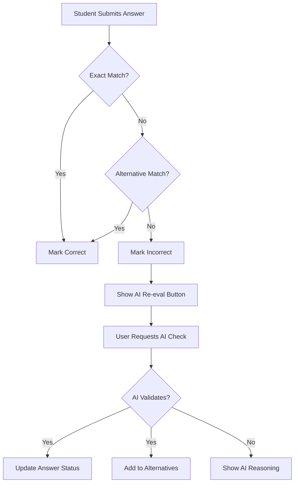

# Design Document: Intelligent Fill-in-the-Blank Answer Validation System

## Executive Summary

This document outlines the design and implementation of an intelligent answer validation system for fill-in-the-blank quiz questions. The system combines exact matching, alternative answer storage, and AI-powered semantic validation to provide a flexible and learnable answer evaluation mechanism that improves over time.

## 1. Problem Statement

### Current Challenges
- Fill-in-the-blank questions often have multiple correct answers (synonyms, different phrasings, abbreviations)
- Traditional exact-match validation frustrates students when semantically correct answers are marked wrong
- Manual maintenance of all possible correct answers is time-consuming for teachers
- No learning mechanism to improve validation accuracy over time

### User Pain Points
- **Students**: Frustration when correct answers are marked wrong due to minor variations
- **Teachers**: Difficulty in anticipating all possible correct answer variations
- **System**: Inefficient use of AI resources for repeated validation of same answers

## 2. Solution Overview

### Core Concept
A three-tier validation system that:
1. Checks exact matches (case-insensitive)
2. Validates against stored alternative answers
3. Uses AI for semantic validation when needed
4. Learns from AI validations to improve future evaluations

### Key Features
- **Alternative Answers Storage**: Database field to store validated answer variations
- **Manual AI Re-evaluation**: User-triggered AI validation for disputed answers
- **Automatic Learning**: System stores AI-validated answers for future use
- **Teacher Management Interface**: UI for teachers to manage alternative answers

## 3. System Architecture

### 3.1 Database Schema

```sql
-- Extended quiz table structure
ALTER TABLE kedge_practice.quizzes
ADD COLUMN alternative_answers TEXT[] DEFAULT '{}';

-- Index for performance
CREATE INDEX idx_quiz_alternative_answers 
ON kedge_practice.quizzes USING GIN(alternative_answers);
```

### 3.2 Data Flow



### 3.3 Component Architecture

```
┌─────────────────────────────────────────────────────────┐
│                     Frontend Layer                       │
├─────────────────────────────────────────────────────────┤
│  QuizPractice.tsx                                        │
│  ├── Answer Submission Logic                             │
│  ├── AI Re-evaluation Button                             │
│  └── Result Display with Feedback                        │
│                                                           │
│  QuizBankManagement.tsx                                  │
│  ├── Alternative Answers Editor                          │
│  └── Answer Statistics Display                           │
└─────────────────────────────────────────────────────────┘
                            │
                            ▼
┌─────────────────────────────────────────────────────────┐
│                      API Layer                           │
├─────────────────────────────────────────────────────────┤
│  practice.controller.ts                                  │
│  ├── POST /sessions/submit-answer                        │
│  └── POST /sessions/ai-reevaluate                        │
│                                                           │
│  quiz.controller.ts                                      │
│  └── PUT /quiz/:id (includes alternative_answers)        │
└─────────────────────────────────────────────────────────┘
                            │
                            ▼
┌─────────────────────────────────────────────────────────┐
│                    Service Layer                         │
├─────────────────────────────────────────────────────────┤
│  practice.service.ts                                     │
│  ├── submitAnswer() - Basic validation                   │
│  └── aiReevaluateAnswer() - AI validation               │
│                                                           │
│  gpt.service.ts                                          │
│  └── validateFillInBlankAnswer() - Semantic validation   │
└─────────────────────────────────────────────────────────┘
                            │
                            ▼
┌─────────────────────────────────────────────────────────┐
│                   Repository Layer                       │
├─────────────────────────────────────────────────────────┤
│  quiz.repository.ts                                      │
│  ├── addAlternativeAnswer()                              │
│  └── updateQuiz()                                        │
│                                                           │
│  practice.repository.ts                                  │
│  └── updateAnswerCorrectness()                           │
└─────────────────────────────────────────────────────────┘
```

## 4. Detailed Implementation

### 4.1 Answer Validation Logic

```typescript
// Three-tier validation approach
async function validateAnswer(userAnswer: string, quiz: Quiz): Promise<boolean> {
  const trimmedAnswer = userAnswer.trim();
  const correctAnswer = quiz.answer;
  
  // Tier 1: Exact match (case-insensitive)
  if (trimmedAnswer.toLowerCase() === correctAnswer.toLowerCase()) {
    return true;
  }
  
  // Tier 2: Alternative answers
  if (quiz.alternative_answers?.some(alt => 
    alt.toLowerCase() === trimmedAnswer.toLowerCase()
  )) {
    return true;
  }
  
  // Tier 3: AI validation (user-triggered)
  // Returns false here, user must manually request AI check
  return false;
}
```

### 4.2 AI Validation with Structured Output

```typescript
const responseSchema = {
  type: 'json_schema',
  json_schema: {
    name: 'answer_validation',
    strict: true,
    schema: {
      type: 'object',
      properties: {
        isCorrect: {
          type: 'boolean',
          description: 'Whether the student answer is semantically correct'
        },
        reasoning: {
          type: 'string',
          description: 'Explanation for the validation judgment'
        }
      },
      required: ['isCorrect', 'reasoning'],
      additionalProperties: false
    }
  }
};

// Using GPT-4o-mini with structured output
const response = await openai.chat.completions.create({
  model: 'gpt-4o-mini',
  messages: [...],
  temperature: 0.3,
  response_format: responseSchema
});
```

### 4.3 Learning Mechanism

```typescript
async function handleAIValidation(quiz: Quiz, userAnswer: string) {
  const validation = await gptService.validateFillInBlankAnswer(
    quiz.question,
    quiz.answer,
    userAnswer,
    quiz.context
  );
  
  if (validation.isCorrect) {
    // Add to alternative answers for future use
    await quizRepository.addAlternativeAnswer(quiz.id, userAnswer);
    
    // Update current session answer status
    await practiceRepository.updateAnswerCorrectness(
      sessionId,
      quiz.id,
      true
    );
    
    return {
      isCorrect: true,
      message: '系统已记录此答案，未来相同答案将自动判定为正确'
    };
  }
  
  return {
    isCorrect: false,
    reasoning: validation.reasoning
  };
}
```

## 5. User Interface Design

### 5.1 Student Practice Interface

#### AI Re-evaluation Button
- **Visibility**: Only shown for incorrect fill-in-the-blank answers
- **Design**: Purple gradient button with sparkle icon
- **States**: 
  - Default: "请求 AI 重新评估"
  - Loading: Spinner with "AI 正在评估中..."
  - Success: Green confirmation message
  - Failure: Yellow message with AI reasoning

#### Feedback Messages
```
✅ Success: "系统已记录此答案为正确答案"
           "未来遇到相同答案时，系统将自动判定为正确 ✨"

⚠️ Failure: "AI判断：[具体原因]"
```

### 5.2 Teacher Management Interface

#### Alternative Answers Editor
```
┌─────────────────────────────────────────┐
│ 替代答案 (系统会接受这些答案为正确)        │
├─────────────────────────────────────────┤
│ ┌───────────────────────────────────┐   │
│ │ [秦始皇] ✕  [嬴政] ✕  [始皇帝] ✕  │   │
│ └───────────────────────────────────┘   │
│                                          │
│ [输入替代答案...        ] [添加]         │
│                                          │
│ 💡 提示：当学生提交的答案被 AI 验证为     │
│ 正确时，系统会自动添加到替代答案列表中     │
└─────────────────────────────────────────┘
```

#### Quiz List Display
- Shows badge: "3 个替代答案" for fill-in-the-blank questions
- Displays standard answer and alternatives in info box

## 6. API Specifications

### 6.1 Submit Answer Endpoint
```typescript
POST /v1/practice/sessions/submit-answer
{
  "session_id": "uuid",
  "question_id": "uuid",
  "answer": "用户答案",
  "time_spent_seconds": 30
}

Response:
{
  "isCorrect": boolean
}
```

### 6.2 AI Re-evaluation Endpoint
```typescript
POST /v1/practice/sessions/ai-reevaluate
{
  "session_id": "uuid",
  "question_id": "uuid",
  "user_answer": "用户答案"
}

Response:
{
  "isCorrect": boolean,
  "reasoning": "AI判断理由",
  "message": "系统消息（如果答案被添加到替代答案）"
}
```

### 6.3 Update Quiz Endpoint
```typescript
PUT /v1/quiz/:id
{
  "quiz": {
    "alternative_answers": ["答案1", "答案2", "答案3"]
    // ... other quiz fields
  }
}
```

## 7. Security & Performance Considerations

### 7.1 Security
- **Input Validation**: All user inputs sanitized and trimmed
- **Rate Limiting**: AI re-evaluation requests limited per user/session
- **Authentication**: All endpoints require JWT authentication
- **Authorization**: Only teachers can edit alternative answers

### 7.2 Performance
- **Database Indexing**: GIN index on alternative_answers array
- **Caching**: Alternative answers cached in memory
- **AI Optimization**: 
  - Use GPT-4o-mini for cost efficiency
  - Structured output for reliable parsing
  - Lower temperature (0.3) for consistency

### 7.3 Scalability
- **Learning Rate**: System improves with usage
- **Reduced AI Calls**: Alternative answers reduce future AI requests
- **Batch Processing**: Support for bulk alternative answer updates

## 8. Migration Strategy

### 8.1 Database Migration
```sql
-- Migration: 1756220842000_add_alternative_answers_to_quiz
ALTER TABLE kedge_practice.quizzes
ADD COLUMN IF NOT EXISTS alternative_answers TEXT[] DEFAULT '{}';

-- Add index for performance
CREATE INDEX IF NOT EXISTS idx_quiz_alternative_answers 
ON kedge_practice.quizzes USING GIN(alternative_answers);
```

### 8.2 Backward Compatibility
- Default empty array for existing quizzes
- Graceful fallback if alternative_answers is null
- No breaking changes to existing API contracts

## 9. Monitoring & Analytics

### 9.1 Key Metrics
- **AI Validation Rate**: % of answers requiring AI validation
- **Learning Rate**: New alternative answers added per day
- **Accuracy Improvement**: Reduction in AI calls over time
- **User Satisfaction**: % of successful re-evaluations

### 9.2 Logging
```typescript
logger.log(`Answer matched alternative: "${userAnswer}" in [${alternatives}]`);
logger.log(`AI validated answer as correct: ${reasoning}`);
logger.log(`Added "${userAnswer}" as alternative for quiz ${quizId}`);
```

## 10. Future Enhancements

### Phase 2 Features
1. **Fuzzy Matching**: Allow minor typos (Levenshtein distance)
2. **Context-Aware Validation**: Consider question context more deeply
3. **Batch Alternative Management**: Import/export alternative answers
4. **Analytics Dashboard**: Visualize learning patterns

### Phase 3 Features
1. **ML Model Training**: Train custom model on validated answers
2. **Cross-Question Learning**: Share alternatives across similar questions
3. **Difficulty Adjustment**: Auto-adjust based on answer patterns
4. **Student Hints**: Suggest corrections for common mistakes

## 11. Testing Strategy

### 11.1 Unit Tests
- Validation logic with various answer formats
- Alternative answer CRUD operations
- AI response parsing

### 11.2 Integration Tests
- End-to-end answer submission flow
- AI re-evaluation workflow
- Database transactions

### 11.3 User Acceptance Tests
- Student can request AI re-evaluation
- Teacher can manage alternative answers
- System learns from validations

## 12. Documentation

### 12.1 User Documentation
- Student guide: "How to use AI re-evaluation"
- Teacher guide: "Managing alternative answers"
- FAQ: Common validation scenarios

### 12.2 Technical Documentation
- API reference with examples
- Database schema documentation
- Deployment guide

## 13. Success Criteria

### Quantitative Metrics
- 50% reduction in false negatives within 30 days
- 70% of AI-validated answers reused within 60 days
- <2 second response time for AI validation

### Qualitative Metrics
- Positive user feedback on answer flexibility
- Reduced support tickets about incorrect marking
- Teacher satisfaction with management interface

## Conclusion

This intelligent fill-in-the-blank answer validation system represents a significant advancement in educational technology, combining the precision of exact matching with the flexibility of AI-powered semantic understanding. The self-learning mechanism ensures continuous improvement, while the teacher management interface maintains human oversight and control.

The system balances automation with user control, providing immediate validation for known answers while offering AI assistance when needed. This approach optimizes both user experience and system resources, creating a sustainable and scalable solution for modern educational platforms.