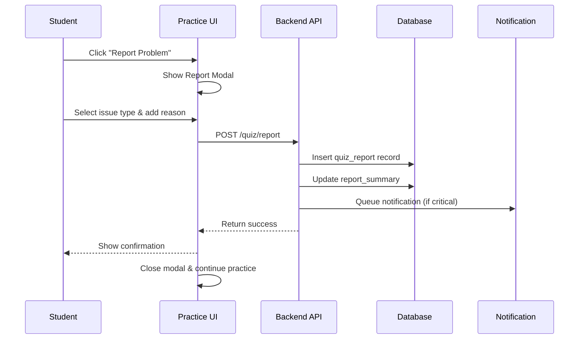
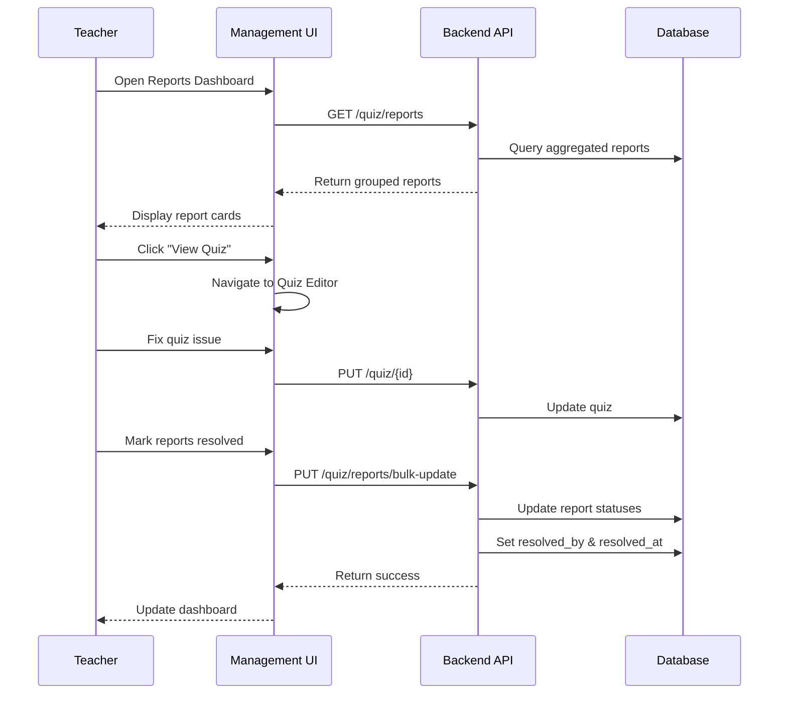

# Quiz Report Feature Design Document
# 题目报错功能设计文档

## 1. Background & Goals / 背景与目标

### Problem Context / 问题背景
During practice sessions, students often encounter various issues with quiz questions that affect their learning experience:
- Display errors (formatting, images not loading, garbled text)
- Incorrect answers or answer keys
- Wrong knowledge point associations
- Duplicate questions
- Unclear or ambiguous question wording

Currently, there's no systematic way for students to report these issues, leading to:
- Persistent quality problems in the quiz bank
- Frustration for students encountering the same issues
- No feedback loop for content improvement
- Teachers unaware of problematic content

### Objectives / 目标
1. **Enable Issue Reporting**: Allow students to quickly report problems during practice
2. **Streamline Issue Management**: Provide teachers/admins with an organized view of reported issues
3. **Track Resolution**: Monitor which issues have been addressed and by whom
4. **Improve Content Quality**: Create a feedback loop for continuous quiz improvement
5. **Minimize Disruption**: Keep reporting process quick and non-intrusive to learning flow

## 2. System Actors / 参与角色

| Role / 角色 | Responsibility / 职责 | Key Actions / 主要操作 |
|-------------|----------------------|------------------------|
| **Student / 学生** | Issue reporter | • Report problems during practice<br>• Select issue type<br>• Provide optional details<br>• Continue practicing seamlessly |
| **Teacher / 教师** | Content maintainer | • Review reported issues<br>• Fix quiz problems<br>• Mark issues as resolved<br>• Bulk manage reports |
| **Admin / 管理员** | System overseer | • Monitor all reports<br>• Assign issues to teachers<br>• View analytics<br>• Manage report categories |
| **System / 系统** | Process facilitator | • Aggregate reports by quiz<br>• Track resolution status<br>• Generate notifications<br>• Provide analytics |

## 3. Report Types / 报错类型

```typescript
enum ReportType {
  DISPLAY_ERROR = 'display_error',        // 显示错误 - Images broken, formatting issues
  WRONG_ANSWER = 'wrong_answer',          // 答案错误 - Answer key is incorrect
  WRONG_ASSOCIATION = 'wrong_association', // 知识点关联错误 - Wrong knowledge point
  DUPLICATE = 'duplicate',                // 题目重复 - Same question appears multiple times
  UNCLEAR_WORDING = 'unclear_wording',    // 题目表述不清 - Ambiguous or confusing
  OTHER = 'other'                         // 其他问题 - Other issues
}
```

### Report Type Details / 报错类型详情

| Type / 类型 | Description / 描述 | Examples / 示例 | Priority |
|------------|-------------------|-----------------|----------|
| **显示错误** | Visual/formatting problems | • Images not loading<br>• Text cut off<br>• Math formulas broken<br>• Incorrect encoding | High |
| **答案错误** | Answer key is wrong | • Correct answer marked wrong<br>• Wrong option marked correct<br>• Missing answer options | Critical |
| **知识点关联错误** | Wrong knowledge point tagged | • History question tagged as Biology<br>• Wrong chapter/unit association | Medium |
| **题目重复** | Duplicate questions in bank | • Exact same question<br>• Minor variations of same question | Low |
| **题目表述不清** | Unclear or ambiguous wording | • Ambiguous options<br>• Typos affecting meaning<br>• Incomplete question | Medium |
| **其他问题** | Any other issues | • Copyright concerns<br>• Offensive content<br>• Technical errors | Variable |

## 4. Data Models / 数据模型

### 4.1 Quiz Report Table
```sql
CREATE TABLE kedge_practice.quiz_reports (
  id UUID PRIMARY KEY DEFAULT uuid_generate_v4(),
  
  -- Report identification
  quiz_id UUID NOT NULL REFERENCES kedge_practice.quizzes(id),
  user_id UUID NOT NULL REFERENCES kedge_practice.users(id),
  session_id UUID REFERENCES kedge_practice.practice_sessions(id),
  
  -- Report details
  report_type VARCHAR(50) NOT NULL,
  reason TEXT, -- Optional detailed description
  
  -- Context (helps teachers understand the issue)
  user_answer TEXT, -- What the student answered
  quiz_context JSONB, -- Snapshot of quiz state when reported
  
  -- Metadata
  created_at TIMESTAMP DEFAULT CURRENT_TIMESTAMP,
  updated_at TIMESTAMP DEFAULT CURRENT_TIMESTAMP,
  
  -- Resolution tracking
  status VARCHAR(20) DEFAULT 'pending', -- pending, reviewing, resolved, dismissed
  resolved_by UUID REFERENCES kedge_practice.users(id),
  resolved_at TIMESTAMP,
  resolution_note TEXT,
  
  -- Indexes for performance
  INDEX idx_quiz_reports_quiz_id (quiz_id),
  INDEX idx_quiz_reports_status (status),
  INDEX idx_quiz_reports_created_at (created_at DESC),
  INDEX idx_quiz_reports_type_status (report_type, status)
);

-- Prevent duplicate reports from same user for same issue
CREATE UNIQUE INDEX idx_unique_user_quiz_report 
ON kedge_practice.quiz_reports(user_id, quiz_id, report_type) 
WHERE status != 'dismissed';
```

### 4.2 Report Analytics View (Materialized)
```sql
CREATE MATERIALIZED VIEW kedge_practice.quiz_report_summary AS
SELECT 
  q.id as quiz_id,
  q.question,
  q.type as quiz_type,
  q.knowledge_point_id,
  COUNT(DISTINCT r.id) as total_reports,
  COUNT(DISTINCT r.user_id) as unique_reporters,
  COUNT(CASE WHEN r.status = 'pending' THEN 1 END) as pending_count,
  COUNT(CASE WHEN r.status = 'resolved' THEN 1 END) as resolved_count,
  ARRAY_AGG(DISTINCT r.report_type) as report_types,
  MAX(r.created_at) as last_reported_at,
  MAX(r.resolved_at) as last_resolved_at
FROM kedge_practice.quizzes q
INNER JOIN kedge_practice.quiz_reports r ON q.id = r.quiz_id
GROUP BY q.id, q.question, q.type, q.knowledge_point_id;

-- Refresh periodically or on demand
CREATE INDEX idx_report_summary_pending ON kedge_practice.quiz_report_summary(pending_count DESC);
```

## 5. API Design / 接口设计

### 5.1 Student APIs (Report Submission)

#### Submit Report
```typescript
POST /v1/quiz/report
Authorization: Bearer {student_token}

Request:
{
  "quiz_id": "uuid",
  "report_type": "display_error" | "wrong_answer" | "wrong_association" | "duplicate" | "unclear_wording" | "other",
  "reason": "Optional detailed description", // Optional, max 500 chars
  "user_answer": "A", // Optional, what student selected
  "session_id": "uuid" // Optional, current practice session
}

Response:
{
  "success": true,
  "data": {
    "report_id": "uuid",
    "message": "感谢您的反馈，我们会尽快处理"
  }
}
```

#### Check My Reports
```typescript
GET /v1/quiz/my-reports?status=pending&limit=10
Authorization: Bearer {student_token}

Response:
{
  "success": true,
  "data": [
    {
      "id": "uuid",
      "quiz_id": "uuid",
      "question": "What is...",
      "report_type": "wrong_answer",
      "reason": "Option B should be correct",
      "created_at": "2024-01-15T10:30:00Z",
      "status": "pending"
    }
  ]
}
```

### 5.2 Teacher/Admin APIs (Management)

#### Get Reported Quizzes (Grouped)
```typescript
GET /v1/quiz/reports?status=pending&sort=report_count&limit=20
Authorization: Bearer {teacher_token}

Response:
{
  "success": true,
  "data": [
    {
      "quiz_id": "uuid",
      "question": "The capital of France is?",
      "quiz_type": "single-choice",
      "knowledge_point": {
        "id": "geo-001",
        "topic": "European Capitals"
      },
      "report_summary": {
        "total_reports": 5,
        "unique_reporters": 3,
        "pending_count": 4,
        "resolved_count": 1,
        "report_types": ["wrong_answer", "unclear_wording"],
        "last_reported": "2024-01-15T10:30:00Z"
      },
      "reports": [
        {
          "id": "report-uuid-1",
          "reporter": {
            "id": "user-uuid",
            "name": "张三",
            "class": "七年级3班"
          },
          "report_type": "wrong_answer",
          "reason": "正确答案应该是B不是C",
          "user_answer": "B",
          "created_at": "2024-01-15T10:30:00Z",
          "status": "pending"
        },
        {
          "id": "report-uuid-2",
          "reporter": {
            "id": "user-uuid-2",
            "name": "李四",
            "class": "七年级5班"
          },
          "report_type": "unclear_wording",
          "reason": "选项描述有歧义",
          "created_at": "2024-01-14T09:20:00Z",
          "status": "pending"
        }
      ]
    }
  ],
  "pagination": {
    "total": 45,
    "page": 1,
    "per_page": 20
  }
}
```

#### Update Report Status
```typescript
PUT /v1/quiz/report/{report_id}/status
Authorization: Bearer {teacher_token}

Request:
{
  "status": "resolved" | "reviewing" | "dismissed",
  "resolution_note": "已修正答案为B选项" // Optional
}

Response:
{
  "success": true,
  "data": {
    "report_id": "uuid",
    "status": "resolved",
    "resolved_by": {
      "id": "teacher-uuid",
      "name": "王老师"
    },
    "resolved_at": "2024-01-15T11:00:00Z"
  }
}
```

#### Bulk Update Reports
```typescript
PUT /v1/quiz/reports/bulk-update
Authorization: Bearer {teacher_token}

Request:
{
  "quiz_id": "uuid", // Update all reports for this quiz
  "status": "resolved",
  "resolution_note": "已修正该题目的所有问题"
}

Response:
{
  "success": true,
  "data": {
    "updated_count": 5,
    "message": "已批量更新5条报错记录"
  }
}
```

#### Get Report Analytics
```typescript
GET /v1/quiz/reports/analytics?period=7d
Authorization: Bearer {admin_token}

Response:
{
  "success": true,
  "data": {
    "summary": {
      "total_reports": 156,
      "pending_reports": 42,
      "resolved_reports": 98,
      "dismissed_reports": 16,
      "avg_resolution_time": "18 hours",
      "most_reported_type": "wrong_answer"
    },
    "by_type": {
      "display_error": 23,
      "wrong_answer": 67,
      "wrong_association": 34,
      "duplicate": 12,
      "unclear_wording": 18,
      "other": 2
    },
    "by_subject": {
      "history": 89,
      "biology": 67
    },
    "top_reporters": [
      {"user_id": "uuid", "name": "张三", "report_count": 15}
    ],
    "resolution_stats": {
      "teachers": [
        {"id": "uuid", "name": "王老师", "resolved_count": 45}
      ]
    }
  }
}
```

## 6. UI/UX Design / 界面设计

### 6.1 Student Report Flow

#### In-Practice Report Button
```typescript
// Location: Next to quiz question during practice
<button 
  className="text-gray-500 hover:text-red-600 text-sm flex items-center gap-1"
  onClick={openReportModal}
>
  <Flag className="w-4 h-4" />
  报告问题
</button>
```

#### Report Modal
```typescript
function ReportModal({ quiz, onSubmit }) {
  return (
    <Modal>
      <h3>报告问题</h3>
      <p className="text-sm text-gray-600">题目：{quiz.question.substring(0, 50)}...</p>
      
      {/* Issue Type Selection */}
      <RadioGroup value={reportType} onChange={setReportType}>
        <Radio value="display_error">
          <span>🖼️ 显示错误</span>
          <span className="text-xs">图片、格式、乱码等</span>
        </Radio>
        <Radio value="wrong_answer">
          <span>❌ 答案错误</span>
          <span className="text-xs">标准答案有误</span>
        </Radio>
        <Radio value="wrong_association">
          <span>🔗 知识点错误</span>
          <span className="text-xs">分类不正确</span>
        </Radio>
        <Radio value="duplicate">
          <span>📑 题目重复</span>
          <span className="text-xs">题库中已存在</span>
        </Radio>
        <Radio value="unclear_wording">
          <span>💭 表述不清</span>
          <span className="text-xs">题目有歧义</span>
        </Radio>
        <Radio value="other">
          <span>📝 其他问题</span>
        </Radio>
      </RadioGroup>
      
      {/* Optional Details */}
      <textarea
        placeholder="请简要描述问题（选填）"
        maxLength={500}
        className="w-full h-20"
      />
      
      <div className="flex justify-end gap-2">
        <Button variant="ghost" onClick={onClose}>取消</Button>
        <Button variant="primary" onClick={handleSubmit}>
          提交报告
        </Button>
      </div>
    </Modal>
  );
}
```

### 6.2 Teacher Management Interface

#### Report Dashboard
```typescript
function ReportDashboard() {
  return (
    <div>
      {/* Summary Cards */}
      <div className="grid grid-cols-4 gap-4 mb-6">
        <Card>
          <h4>待处理</h4>
          <p className="text-2xl font-bold text-red-600">42</p>
        </Card>
        <Card>
          <h4>处理中</h4>
          <p className="text-2xl font-bold text-yellow-600">8</p>
        </Card>
        <Card>
          <h4>已解决</h4>
          <p className="text-2xl font-bold text-green-600">156</p>
        </Card>
        <Card>
          <h4>本周新增</h4>
          <p className="text-2xl font-bold">23</p>
        </Card>
      </div>
      
      {/* Filter Bar */}
      <div className="flex gap-2 mb-4">
        <Select placeholder="报错类型">
          <option value="">全部类型</option>
          <option value="wrong_answer">答案错误</option>
          <option value="display_error">显示错误</option>
        </Select>
        <Select placeholder="状态">
          <option value="pending">待处理</option>
          <option value="reviewing">处理中</option>
          <option value="resolved">已解决</option>
        </Select>
        <Select placeholder="排序">
          <option value="report_count">报错次数</option>
          <option value="created_at">最新报错</option>
        </Select>
      </div>
      
      {/* Reported Quizzes List */}
      <div className="space-y-4">
        {reportedQuizzes.map(item => (
          <ReportedQuizCard 
            key={item.quiz_id}
            quiz={item}
            onResolve={handleResolve}
            onViewQuiz={handleViewQuiz}
          />
        ))}
      </div>
    </div>
  );
}
```

#### Reported Quiz Card (Expandable)
```typescript
function ReportedQuizCard({ quiz, onResolve, onViewQuiz }) {
  const [expanded, setExpanded] = useState(false);
  
  return (
    <Card className="border-l-4 border-l-red-500">
      <div className="flex justify-between items-start">
        <div className="flex-1">
          <h4 className="font-medium">{quiz.question}</h4>
          <div className="flex gap-4 text-sm text-gray-600 mt-1">
            <span>📚 {quiz.knowledge_point.topic}</span>
            <span>📊 {quiz.report_summary.total_reports} 次报错</span>
            <span>👥 {quiz.report_summary.unique_reporters} 人</span>
          </div>
          
          {/* Report Type Tags */}
          <div className="flex gap-2 mt-2">
            {quiz.report_summary.report_types.map(type => (
              <Tag key={type} color={getColorForType(type)}>
                {getReportTypeLabel(type)}
              </Tag>
            ))}
          </div>
        </div>
        
        <div className="flex gap-2">
          <Button size="sm" onClick={() => onViewQuiz(quiz.quiz_id)}>
            查看题目
          </Button>
          <Button 
            size="sm" 
            variant="ghost"
            onClick={() => setExpanded(!expanded)}
          >
            {expanded ? '收起' : '展开'} ({quiz.report_summary.pending_count})
          </Button>
        </div>
      </div>
      
      {/* Expandable Report Details */}
      {expanded && (
        <div className="mt-4 border-t pt-4">
          <h5 className="font-medium mb-3">报错详情：</h5>
          <div className="space-y-3">
            {quiz.reports.map(report => (
              <div key={report.id} className="flex justify-between items-start bg-gray-50 p-3 rounded">
                <div className="flex-1">
                  <div className="flex items-center gap-2">
                    <span className="font-medium">{report.reporter.name}</span>
                    <span className="text-sm text-gray-500">{report.reporter.class}</span>
                    <Tag size="sm">{getReportTypeLabel(report.report_type)}</Tag>
                  </div>
                  {report.reason && (
                    <p className="text-sm text-gray-600 mt-1">"{report.reason}"</p>
                  )}
                  {report.user_answer && (
                    <p className="text-sm text-gray-500 mt-1">
                      学生答案：{report.user_answer}
                    </p>
                  )}
                  <p className="text-xs text-gray-400 mt-1">
                    {formatRelativeTime(report.created_at)}
                  </p>
                </div>
                
                {report.status === 'pending' && (
                  <Button 
                    size="xs" 
                    variant="success"
                    onClick={() => onResolve(report.id)}
                  >
                    标记已解决
                  </Button>
                )}
                {report.status === 'resolved' && (
                  <div className="text-xs text-green-600">
                    ✓ {report.resolved_by.name} 已处理
                  </div>
                )}
              </div>
            ))}
          </div>
          
          {/* Bulk Actions */}
          <div className="flex justify-end gap-2 mt-4">
            <Button 
              size="sm" 
              variant="outline"
              onClick={() => handleDismissAll(quiz.quiz_id)}
            >
              全部忽略
            </Button>
            <Button 
              size="sm" 
              variant="success"
              onClick={() => handleResolveAll(quiz.quiz_id)}
            >
              全部标记已解决
            </Button>
          </div>
        </div>
      )}
    </Card>
  );
}
```

## 7. Workflow Diagrams / 流程图

### 7.1 Student Report Flow


### 7.2 Teacher Resolution Flow


## 8. Implementation Phases / 实施阶段

### Phase 1: Backend Foundation (2 days)
- [ ] Create database migrations for quiz_reports table
- [ ] Implement report submission API
- [ ] Add basic validation and duplicate prevention
- [ ] Create report aggregation queries

### Phase 2: Student Reporting UI (2 days)
- [ ] Add report button to QuizPractice component
- [ ] Create ReportModal component
- [ ] Implement report submission flow
- [ ] Add success/error feedback

### Phase 3: Teacher Management Interface (3 days)
- [ ] Create Reports Dashboard page
- [ ] Implement report listing with grouping
- [ ] Add filtering and sorting options
- [ ] Create bulk resolution actions

### Phase 4: Analytics & Improvements (2 days)
- [ ] Add analytics endpoints
- [ ] Create report statistics views
- [ ] Implement notification system
- [ ] Add export functionality

### Phase 5: Testing & Refinement (1 day)
- [ ] End-to-end testing
- [ ] Performance optimization
- [ ] UI/UX improvements
- [ ] Documentation

## 9. Security & Performance Considerations / 安全与性能

### Security / 安全
- **Rate Limiting**: Max 10 reports per user per hour
- **Duplicate Prevention**: One active report per (user, quiz, type)
- **Authorization**: Students can only view own reports
- **Input Validation**: Sanitize reason text, limit length
- **Audit Trail**: Log all status changes with user info

### Performance / 性能
- **Indexing**: Optimize queries with proper indexes
- **Caching**: Cache report summaries (5-minute TTL)
- **Pagination**: Limit results to prevent large payloads
- **Async Processing**: Queue notifications to avoid blocking
- **Materialized Views**: Pre-aggregate common queries

## 10. Success Metrics / 成功指标

| Metric / 指标 | Target / 目标 | Measurement / 测量方法 |
|--------------|--------------|----------------------|
| **Report Submission Rate** | 2-5% of practice sessions | Reports / Total Sessions |
| **Resolution Time** | < 24 hours average | AVG(resolved_at - created_at) |
| **Resolution Rate** | > 80% within 48 hours | Resolved / Total Reports |
| **False Positive Rate** | < 20% dismissed | Dismissed / Total Reports |
| **User Satisfaction** | > 4.0/5.0 rating | Post-resolution survey |
| **Content Quality** | 30% reduction in errors | Monthly error rate trend |

## 11. Future Enhancements / 未来增强

1. **AI-Powered Validation**: Auto-validate reported answers using GPT
2. **Similar Report Clustering**: Group similar reports automatically
3. **Student Reputation System**: Weight reports by reporter reliability
4. **Auto-Resolution**: Automatically fix simple issues (e.g., typos)
5. **Report Templates**: Pre-defined report reasons for common issues
6. **Mobile App Integration**: Report from mobile practice app
7. **Crowdsourced Fixes**: Let high-performing students suggest fixes
8. **Integration with Quiz Parser**: Auto-flag problematic imports

## 12. API Response Examples / 接口响应示例

### Successful Report Submission
```json
{
  "success": true,
  "data": {
    "report_id": "f47ac10b-58cc-4372-a567-0e02b2c3d479",
    "message": "感谢您的反馈，我们会尽快处理",
    "estimated_resolution": "24-48 hours"
  }
}
```

### Duplicate Report Detection
```json
{
  "success": false,
  "error": {
    "code": "DUPLICATE_REPORT",
    "message": "您已经报告过这个问题，我们正在处理中",
    "existing_report_id": "e72ac10b-58cc-4372-a567-0e02b2c3d480",
    "status": "pending"
  }
}
```

### Rate Limit Exceeded
```json
{
  "success": false,
  "error": {
    "code": "RATE_LIMIT_EXCEEDED",
    "message": "您提交报告太频繁，请10分钟后再试",
    "retry_after": 600
  }
}
```

## Appendix: Database Indexes / 附录：数据库索引

```sql
-- Performance indexes
CREATE INDEX idx_quiz_reports_quiz_id ON kedge_practice.quiz_reports(quiz_id);
CREATE INDEX idx_quiz_reports_user_id ON kedge_practice.quiz_reports(user_id);
CREATE INDEX idx_quiz_reports_status ON kedge_practice.quiz_reports(status);
CREATE INDEX idx_quiz_reports_type ON kedge_practice.quiz_reports(report_type);
CREATE INDEX idx_quiz_reports_created_at ON kedge_practice.quiz_reports(created_at DESC);

-- Compound indexes for common queries
CREATE INDEX idx_reports_quiz_status ON kedge_practice.quiz_reports(quiz_id, status);
CREATE INDEX idx_reports_type_status ON kedge_practice.quiz_reports(report_type, status);
CREATE INDEX idx_reports_user_quiz_type ON kedge_practice.quiz_reports(user_id, quiz_id, report_type);

-- Partial index for pending reports (most frequently queried)
CREATE INDEX idx_pending_reports ON kedge_practice.quiz_reports(quiz_id, created_at DESC) 
WHERE status = 'pending';
```