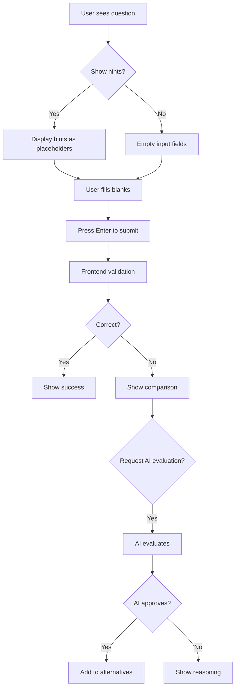
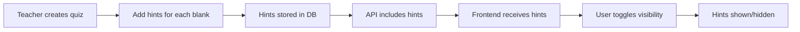

# Fill-in-the-Blank Quiz Feature - Complete Documentation

## Overview
This document provides comprehensive documentation of the fill-in-the-blank quiz feature implementation in the Kedge self-practice learning platform. It covers both the student practice interface and the teacher quiz management interface, including all recent enhancements.

## Architecture Overview

### Frontend Components
- **FillInBlankQuestion.tsx**: Main component for student quiz practice
- **QuizEditModal.tsx**: Teacher interface for editing quiz questions
- **QuizDetailModal.tsx**: Read-only view of quiz details

### Backend Services
- **QuizRepository**: Database layer for quiz operations
- **API Endpoints**: REST APIs for quiz CRUD operations

## Student Practice Interface

### Core Features

#### 1. Answer Input System
- **Multiple Blanks Support**: Questions can have unlimited blanks marked with `___`
- **Keyboard Navigation**:
  - `Tab`: Move to next blank
  - `Shift+Tab`: Move to previous blank  
  - `Enter`: Submit answer (requires at least one filled blank)
- **Visual Feedback**:
  - Blue underline for active input field
  - Green checkmark (✅) for correct answers
  - Red X mark (❌) for incorrect answers

#### 2. Hints System
The hints feature provides contextual assistance for each blank:

```typescript
// Hint toggle button implementation
{question.hints && question.hints.length > 0 && question.hints.some(h => h !== null) && (
  <button
    onClick={onToggleHints}
    className={`flex items-center gap-2 px-3 py-1.5 text-sm font-medium rounded-lg transition-all duration-200 ${
      showHints 
        ? 'text-blue-700 bg-blue-50 border border-blue-200' 
        : 'text-gray-700 bg-white border border-gray-300'
    }`}
  >
    <Lightbulb className={`w-4 h-4 ${showHints ? 'fill-current' : ''}`} />
    <span>{showHints ? '隐藏提示' : '显示提示'}</span>
    <span className="text-xs text-gray-500">({question.hints.filter(h => h !== null).length})</span>
  </button>
)}
```

**Features**:
- Toggle visibility with lightbulb icon button
- Shows hint count in badge
- Blue highlight when active
- Hints appear as placeholder text in input fields
- Position-specific hints for each blank

#### 3. Answer Validation
- **Case-insensitive comparison**: Handles uppercase/lowercase variations
- **Whitespace trimming**: Removes extra spaces automatically
- **Alternative answers**: System checks multiple acceptable answers
  ```typescript
  // Alternative answer checking logic
  1. Check main answer
  2. Check position-specific alternatives (e.g., [0]alternative)
  3. Check general alternatives (apply to any position)
  ```

#### 4. Quick Answer Reveal
```typescript
// "不知道，直接看答案" button
<button onClick={handleGiveUp}>
  <Eye className="w-4 h-4" />
  不知道，直接看答案
</button>
```
- Immediately shows correct answers
- Submits all blanks as empty
- Still tracks as incorrect attempt

#### 5. AI-Powered Re-evaluation
```typescript
// AI re-evaluation button (only shows if user attempted)
{sessionId && !aiEvaluation && !userGaveUp && answers.some(a => a && a.trim()) && (
  <button onClick={handleAiReevaluation}>
    <Brain className="w-4 h-4" />
    让AI重新评估我的答案
  </button>
)}
```

**Process**:
1. User submits answer marked as incorrect
2. Can request AI re-evaluation
3. AI considers context and semantics
4. Provides detailed reasoning
5. If approved, answer becomes alternative for future students

### Answer Comparison Display
After submission, shows side-by-side comparison:

```typescript
<div className="grid grid-cols-2 gap-4">
  <div>
    <div className="text-xs font-medium text-gray-600 mb-1">你的答案</div>
    <div className={`font-medium ${answers[idx] ? 'text-red-600' : 'text-gray-400'}`}>
      {answers[idx] || '(未填写)'}
    </div>
  </div>
  <div>
    <div className="text-xs font-medium text-gray-600 mb-1">正确答案</div>
    <div className="font-medium text-green-600">
      {correctAns}
    </div>
  </div>
</div>
```

## Teacher Quiz Management Interface

### Quiz Edit Modal Structure

The quiz edit modal has been optimized for better user experience with the following field ordering:

1. **Question Type** (inline layout)
2. **Question Content**
3. **Options** (for choice questions)
4. **Hints** (for fill-in-blank)
5. **Alternative Answers** (for fill-in-blank)
6. **Answer**
7. **Knowledge Point**
8. **Tags**

### Hints Management for Fill-in-Blank

#### Display Format
```typescript
<div className="bg-gray-50 rounded-lg p-3 border border-gray-200">
  <div className="text-sm font-medium text-gray-700 mb-1">
    空格 {index + 1}
  </div>
  <div className="text-sm text-green-600 font-medium mb-2">
    正确答案: {correctAnswer || '(未设置)'}
  </div>
  <div className="flex items-center gap-2">
    <label className="text-sm text-gray-600">提示:</label>
    <input 
      type="text"
      value={hint || ''}
      onChange={(e) => handleHintChange(index, e.target.value)}
      placeholder="输入提示词，如：人名、地名、朝代等"
    />
  </div>
</div>
```

**Key Features**:
- Shows correct answer alongside each hint
- Clear visual hierarchy with cards
- Placeholder guidance for teachers
- Add/remove hints dynamically
- Auto-syncs hint array with answer blanks

### Alternative Answers Management

```typescript
// Alternative answers section
<div className="space-y-2">
  {editingQuiz.alternative_answers?.map((altAnswer, index) => (
    <div className="flex items-center gap-2">
      <input
        type="text"
        value={altAnswer || ''}
        onChange={(e) => updateAlternativeAnswer(index, e.target.value)}
        placeholder="备选答案"
      />
      <button onClick={() => removeAlternativeAnswer(index)}>
        <Trash2 className="w-4 h-4" />
      </button>
    </div>
  ))}
  <button onClick={addAlternativeAnswer}>
    添加备选答案
  </button>
</div>
```

## Backend Implementation

### Database Schema

```sql
-- Quizzes table structure
CREATE TABLE kedge_practice.quizzes (
  id UUID PRIMARY KEY DEFAULT gen_random_uuid(),
  type TEXT NOT NULL,
  question TEXT NOT NULL,
  options JSONB,
  answer JSONB NOT NULL,
  answer_index INTEGER[],
  hints JSONB,
  alternative_answers TEXT[],
  knowledge_point_id UUID,
  tags JSONB,
  images JSONB,
  created_at TIMESTAMP DEFAULT NOW(),
  updated_at TIMESTAMP DEFAULT NOW()
);
```

### Quiz Repository Methods

#### getQuizzesByIds
```typescript
async getQuizzesByIds(ids: string[]): Promise<QuizItem[]> {
  const result = await this.persistentService.pgPool.query(
    sql.unsafe`
      SELECT 
        q.id, q.type, q.question, q.options, q.answer,
        q.answer_index, q.alternative_answers,
        COALESCE(q.hints, '[]'::jsonb) as hints,
        -- ... other fields
      FROM kedge_practice.quizzes q
      LEFT JOIN kedge_practice.knowledge_points kp ON q.knowledge_point_id = kp.id
      WHERE q.id = ANY(${sql.array(ids, 'uuid')})
    `
  );
  // Return quizzes in the same order as input IDs
  const quizMap = new Map(result.rows.map(quiz => [quiz.id, quiz]));
  return ids.map(id => quizMap.get(id)).filter(Boolean);
}
```

**Key Points**:
- Includes hints and alternative_answers in query
- Uses COALESCE for null-safe hints
- Maintains order of input IDs

#### addAlternativeAnswer
```typescript
async addAlternativeAnswer(quizId: string, alternativeAnswer: string): Promise<boolean> {
  // Check if answer already exists
  if (quiz.alternative_answers?.includes(trimmedAnswer)) {
    return true;
  }
  
  // Add new alternative answer
  const result = await this.persistentService.pgPool.query(
    sql.unsafe`
      UPDATE kedge_practice.quizzes
      SET alternative_answers = array_append(
        COALESCE(alternative_answers, ARRAY[]::TEXT[]), 
        ${trimmedAnswer}
      )
      WHERE id = ${quizId}
    `
  );
}
```

## Data Flow

### Practice Session Flow



### Hint System Flow



## UI/UX Improvements

### Recent Enhancements

1. **Hints Display in Edit Modal**
   - Shows correct answer with each hint
   - Card-based layout for clarity
   - Visual hierarchy improvements

2. **Form Field Reordering**
   - Logical flow: question → answers → metadata
   - Inline question type selector
   - Removed difficulty field for simplicity

3. **Visual Feedback**
   - Lightbulb icon for hints toggle
   - Fill effect when hints active
   - Hint count badge

4. **Keyboard Accessibility**
   - Full keyboard navigation
   - Enter key submission
   - Tab/Shift-Tab for field navigation

## Best Practices

### For Teachers

1. **Creating Effective Hints**
   - Be specific but not too revealing
   - Use categories (e.g., "人名", "地名", "年份")
   - Consider difficulty level

2. **Setting Alternative Answers**
   - Include common variations
   - Consider different romanizations
   - Add acceptable synonyms

### For Students

1. **Using Hints Strategically**
   - Try without hints first
   - Use hints for learning, not just answers
   - Review hint patterns for future questions

2. **Leveraging AI Evaluation**
   - Use for conceptually correct answers
   - Learn from AI feedback
   - Understand why answers are accepted/rejected

## Testing Checklist

### Functional Tests
- [ ] Multiple blanks work correctly
- [ ] Tab navigation between blanks
- [ ] Enter key submission (with validation)
- [ ] Hints toggle visibility
- [ ] Hints appear as placeholders
- [ ] Answer validation (case/whitespace)
- [ ] Alternative answers accepted
- [ ] AI evaluation triggers correctly
- [ ] Give up button shows answers

### UI Tests
- [ ] Hints button shows count
- [ ] Lightbulb icon fills when active
- [ ] Answer comparison displays correctly
- [ ] Edit modal shows answers with hints
- [ ] Form fields in correct order
- [ ] Mobile responsive layout

### Data Tests
- [ ] Hints saved to database
- [ ] Hints loaded from API
- [ ] Alternative answers persist
- [ ] AI-approved answers saved
- [ ] Order preservation in getQuizzesByIds

## Troubleshooting

### Common Issues

1. **Hints not showing**
   - Check if hints exist in database
   - Verify API includes hints field
   - Ensure frontend receives hints data

2. **Alternative answers not working**
   - Verify alternative_answers array in DB
   - Check answer validation logic
   - Ensure proper trimming/case handling

3. **AI evaluation fails**
   - Check sessionId exists
   - Verify API endpoint available
   - Check network/CORS issues

## Future Enhancements

### Planned Features
1. **Partial Credit System**
   - Award points for partially correct answers
   - Weight different blanks differently

2. **Progressive Hints**
   - Multiple hint levels
   - Reveal hints gradually
   - Penalty for using hints

3. **Smart Suggestions**
   - Auto-complete based on context
   - Common answer patterns
   - Learning from student inputs

4. **Analytics Dashboard**
   - Hint usage statistics
   - Common wrong answers
   - Success rates per blank

## Code Examples

### Creating a Fill-in-Blank Question
```typescript
const question = {
  type: 'fill-in-the-blank',
  question: '中国的首都是___，美国的首都是___。',
  answer: ['北京', '华盛顿'],
  hints: ['城市名', '城市名'],
  alternative_answers: ['北京市', 'Washington', 'DC']
};
```

### Handling Multiple Blanks
```typescript
const blanksCount = question.question.split(/_{2,}/g).length - 1;
const answers = new Array(blanksCount).fill('');

// Process each blank
answers.forEach((answer, index) => {
  const hint = question.hints?.[index];
  const correctAnswer = question.answer[index];
  // Validate answer...
});
```

## Version History

### v2.0 (Current)
- Added hints system with toggle
- Improved edit modal with answer display
- Reordered form fields
- Added lightbulb icon for hints
- Fixed backend hint loading

### v1.0
- Basic fill-in-blank functionality
- Multiple blanks support
- Alternative answers
- AI re-evaluation

---

*Last Updated: 2024*
*Component Locations:*
- Frontend: `/frontend-practice/src/components/QuizPractice/FillInBlankQuestion.tsx`
- Edit Modal: `/frontend-practice/src/components/QuizEditModal.tsx`
- Backend: `/backend/packages/libs/quiz/src/lib/quiz.repository.ts`